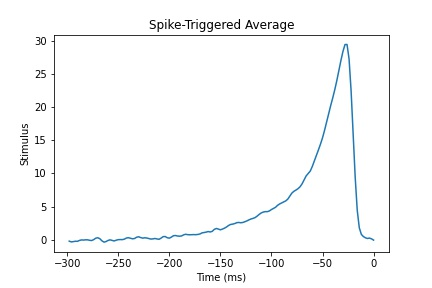
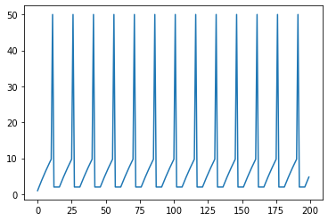

# Computational NeuroScience - University of Washington

This respository serves as a companion Journal for the Computational Neusroscience course given by the University of Washington. The actual course offered by Coursera can be found here [https://www.coursera.org/learn/computational-neuroscience](https://www.coursera.org/learn/computational-neuroscience).

## Course Description from the Website

This course provides an introduction to basic computational methods for understanding what nervous systems do and for determining how they function. We will explore the computational principles governing various aspects of vision, sensory-motor control, learning, and memory. Specific topics that will be covered include representation of information by spiking neurons, processing of information in neural networks, and algorithms for adaptation and learning. We will make use of Matlab/Octave/Python demonstrations and exercises to gain a deeper understanding of concepts and methods introduced in the course. The course is primarily aimed at third- or fourth-year undergraduates and beginning graduate students, as well as professionals and distance learners interested in learning how the brain processes information.

## Useful Links for the Projects

A computational neuroscientist's library: Some recommended additional textbooks:

- Anastasio. Tutorial on Neural Systems Modeling. Gentle introduction to neural modeling; comes with Matlab code for examples in the book.

- Johnston and Wu, Foundations of Cellular Neurophysiology. The classic text for quantitative neurophysiology.

- Koch, The Biophysics of Computation. A compendium of neuronal hardware, its dynamics and functional implications for coding.

- Izhikevich, Dynamical systems in neuroscience. A highly recommended introduction to nonlinear dynamics applied to neuronal excitability.

- Rieke et al. Spikes: Exploring the Neural Code. Classic introductory book on neural coding.

-Two-Dimensional Time Coding in the Auditory Brainstem. Slee, S. J., et al. The Journal of Neuroscience, October 26, 2005•25(43):9978 –9988

- Selectivity for Multiple Stimulus Features in Retinal Ganglion Cells. Fairhall, A. L. (November 01, 2006). Journal of Neurophysiology, 96, 5.

- Characterization of neural responses with stochastic stimuli. Simoncelli, E. P., Paninski, L., Pillow, J., & Schwartz, O. (2004). The cognitive neurosciences, 3, 327-338.

- Analyzing Neural Responses to Natural Signals: Maximally Informative Dimensions. Sharpee, Tatyana, Nicole C. Rust, and William Bialek. Neural computation 16.2 (2004): 223-250.

- A Mathematical Theory of Communication. Shannon, C. E. The Bell System Technical Journal 27 (1948): 379-423, 623-656.

- A Neural Substrate of Prediction and Reward. Shultz, W., et al. Science 275 1593 (1997).

- Adaptation and Natural Stimulus Statistics. Fairhall, in Cognitive Neuroscience, ed. Gazzaniga (2014)

Linear Algebra notes: [http://www.cns.nyu.edu/~eero/NOTES/geomLinAlg.pdf](http://www.cns.nyu.edu/~eero/NOTES/geomLinAlg.pdf).

### Summary

This repository contains files that correspond to different tasks, projects and notes from the course. The code is written in MATLAB/OCTAVE (*.m) and Python (*.py). 

## 1. Spike Triggered Averages: A Glimpse Into Neural Encoding

According to [https://en.wikipedia.org/wiki/Spike-triggered_average](https://en.wikipedia.org/wiki/Spike-triggered_average); The spike-triggered average (STA) is a tool for characterizing the response properties of a neuron using the spikes emitted in response to a time-varying stimulus. The STA provides an estimate of a neuron's linear receptive field. It is a useful technique for the analysis of electrophysiological data. 

Mathematically, the STA is the average stimulus preceding a spike.[1][2][3][4] To compute the STA, the stimulus in the time window preceding each spike is extracted, and the resulting (spike-triggered) stimuli are averaged (see diagram). The STA provides an unbiased estimate of a neuron's receptive field only if the stimulus distribution is spherically symmetric (e.g., Gaussian white noise).

### Examples of Linear Filtering Systems

Having, $x(t)$ as the input signal as a function of time $t$ and the output signal denoted by $y(t)$:

1. $y(t) = \int_{0}^{\infty} e^{\tau}x(t - \tau) \, d\tau$

2. $y(t) = \sum_{n=0}^{\infty} a^{n} x(t - n\tau)$ where $a$ is between 0 and 1 and $\tau$ is positive.

3. $y(t) = 3x(t) - 5x(t - \tau)$ where $\tau$ is positive.

- $y(t) = cos[x(t - \theta)]$ does not contain a convolution and thus, is not a LFS.


### STA for a Neuron

STA is the stimuli preceding a spike, averaged over all stimuli that elicited a spike.

### Sampling Period

Given that the sampling rate for the dataset was 500 Hz and the vectors have a dimmension of 600000, the sampling period is $\frac{600000}{500} \times \frac{1}{600} = 2$ ms.

### Number of Time Steps

We wish to compute the spike-triggered average for this neuron over a window of width 300 ms. Suppose we do not care about the value exactly 300 ms before the spike. therefore, the number of time steps for the resulting spike-triggered average vector is $\frac{300}{2}=150$ ms.

### Total Number of Spikes

In order to calculate the average, it is necessary for us to know how many time windows (stimulus vectors) we are averaging over. This is equal to the number of observed spikes. We Wrote  the code to calculate the total number of spikes in the data set c1p8.mat. Having as the result 53583 spikes.

```
"""
In Python:
"""

spike_times = rho[num_timesteps:].nonzero()[0] + num_timesteps

num_spikes = len(spike_times)

print(num_spikes)

%%%%
% In MATLAB/OCTAVE

num_spikes = size(spike_times,1);
```

### Computation of the Spike-Triggered Average

The spike-triggered average is the element-wise mean of the time windows starting 300 ms before (exclusive) and ending 0 ms before a spike. The following code computes the STA:

```
"""
In Python: 
"""
for i in range(num_spikes):
        AllWindows = stim[(spike_times[i] - num_timesteps):spike_times[i]]
        sta = sta + AllWindows
    sta = sta/num_spikes

%%%%%
% In MATLAB/OCTAVE

 for i=1:num_spikes
            AllWindows=stim(spike_times(i)-num_timesteps+1:spike_times(i));
            sta = sta + AllWindows;
        end
    
    sta=sta/num_spikes;
```

The resulting STA is shown is the next Figure:




### Mathematical Operation of the Stimulus

The nature of this neuron is the Leaky integration operation in order to make computations.

### Most Likely Stimuli

Given that all non-zero values of the stimulus have the same magnitude. That is, assume that all positive stimuli have a value of $c$ and all negative stimuli have a value of $-c$ where $c > 0$. The neuron is more strongly/likely to respond to a **constant positive value**.

### More Features

If we had more features that affected the spikes, then we could use PCA to determine which modes (features) have a correlated effect with the neuron.

**Please refer to the STA.py and STA.m source files in the week 2 folder for details.**

## 2. Neural Decoding

A practical example: 

Suppose we have a stimulus defined by a single variable called ss. ss can take one of two values, which we will call $s_1$ and $s_2$. You could think of these as lights flashing in the eyes at one of two possible frequencies. Or perhaps listening to punk rock vs. listening to Dvorak.

Let's call the firing rate response of a neuron to this stimulus $r$.

Suppose that under stimulus $s_1$ the response rate of the neuron can be roughly approximated with a Gaussian distribution with the following parameters: $\mu = 5$, $\sigma = 0.5$.

and for $s_2$: $\mu = 7$ and $\sigma = 1$. Lets say that both stimuli are equally likely and we are given no other prior information. Now let's throw in another twist. Let's say that we receive a measurement of the neuron's response and want to guess which stimulus was presented, but that to us, it is twice as bad to mistakenly think it is s_2  than to mistakenly think it is s_1.

### Which firing rate would make the best decision threshold for us in determining the value of s given a neuron's firing rate?

**5.978** found with the following code:

```
%In matlab inside week3 folder on file stimuli.m

pkg load symbolic
syms s
s_threshold = solve(2*normpdf(s,5,0.5)==normpdf(s,7,1),s)
print(s_threshold)
```

### Suppose we are diagnosing a very rare illness, which happens only once in 100 million people on average. Luckily, we have a test for this illness but it is not perfectly accurate. If somebody has the disease, it will report positive 99% of the time. If somebody does not have the disease, it will report positive 2% of the time. Suppose a patient walks in and tests positive for the disease. Using the maximum likelihood (ML) criterion, would we diagnose them positive?

**Yes** 

### What if we used the maximum a posteriori (MAP) criterion?

**No**

### Why do we see a difference between the two criteria, if there is one?

**The role of prior probability is different between the two.**

## 3. Information Theory and Neural Coding

This subject is mainly related to information theory, please check the notes related to entropy (fancy mathematical way of saying uncertainty) and mutual information.

- Suppose that we have a neuron which, in a given time period, will fire with probability 0.1, yielding a Bernoulli distribution for the neuron's firing (denoted by the random variable F = 0 or 1) with P(F = 1) = 0.1.
What is the entropy of P?

**0.4690**
```
"""
In python
"""

def getEntropy():
    from math import log2
    print((-0.1 * log2(0.1) - 0.9 * log2(0.9)))
```

- Now lets add a stimulus to the picture. Suppose that we think this neuron's activity is related to a light flashing in the eye. Let us say that the light is flashing in a given time period with probability 0.10. Call this stimulus random variable SS.
If there is a flash, the neuron will fire with probability 1/2. If there is not a flash, the neuron will fire with probability 1/18. Call this random variable FF (whether the neuron fires or not).
Which of these is closest, in bits (log base 2 units), to the mutual information MI(S,F)?

**0.0904**

- Suppose we want to build a complex image. We could do that by layering a whole bunch of pieces together (mathematically - summing). This is like drawing on transparencies with various levels of opacity and putting them on top of each other. Those familiar with Photoshop or Gimp will recognize that concept. If we had to build an image in Photoshop with a bicycle on a road, for instance, perhaps we could have an image of a sky, and one of the road, and one of the bike. We could "add" these pieces together to make our target image.

Of course, if our neural system was trying to make visual fields that worked for any sort of input, we would want more than just roads, skies, and bikes to work with! One possibility is to have a bunch of generic shapes of various sizes, orientations, and locations within the image. If we chose the right variety, we could blend/sum these primitive pieces together to make just about any image! One way to blend them is to let them have varying transparencies/opacities, and to set them on top of each other. That is what we would call a weighted sum, where the weights are how transparent each piece is.

Of course, we may not want to have too many possible shapes to use. As mentioned in the video, the organism likely wants to conserve energy. That means having as few neurons firing as possible at once. If we conceptually make a correlation between these shapes and the neurons, then we can point out we would want to use as few shapes as we could while maintaining an accurate image.

This math gives us a way of summing a bunch of pieces together to represent an image, to attempt to make that representation look as much like the image as possible, and to make that representation efficient - using as few pieces as possible. That is a lot of work for two lines of math!

**The pieces that make up the image.**

- Check the .py and .m scripts for a description of the exercises of the week.

## 4. Computing in Carbon

- When we talk about "spikes", we are referring to the change in some property of the neuron over time. When we typically plot a spike, the x-axis represents time. What does the y-axis represent?

**voltage**



## 5. Computing with Networks

Please refer to the notes on linear and nonlinear recurrent networks and the scripts in the week 6 folder.

## 6. 
